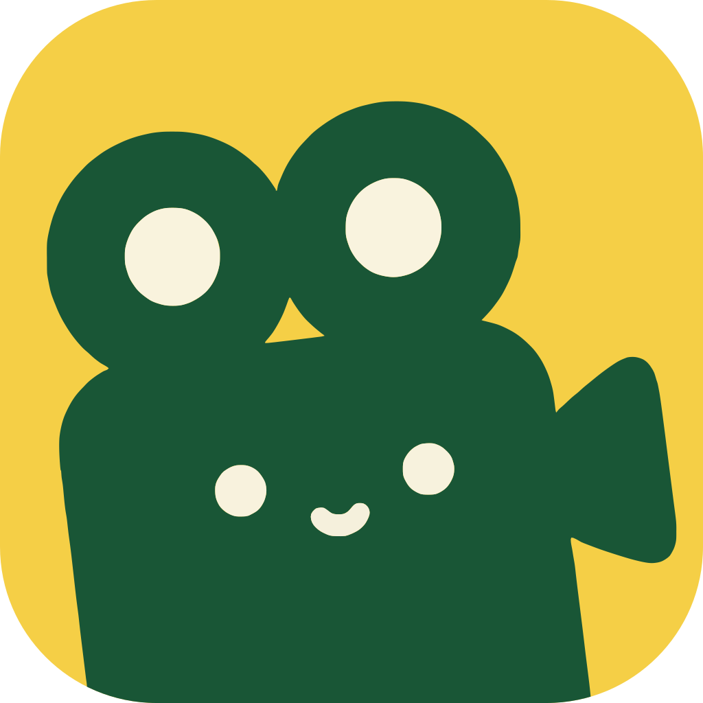
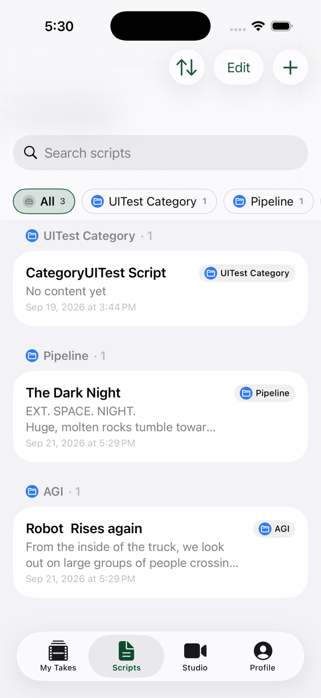
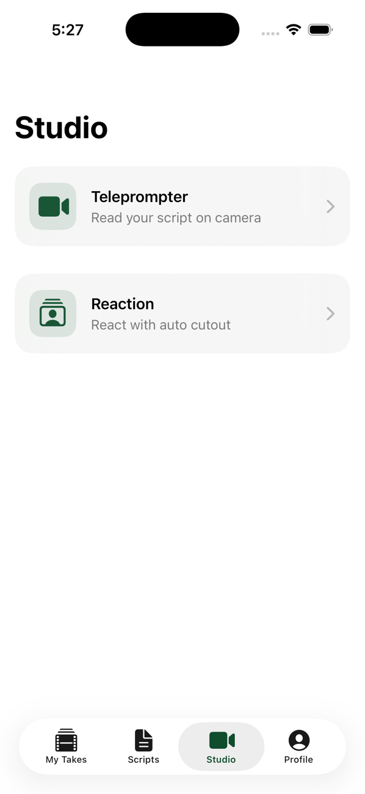
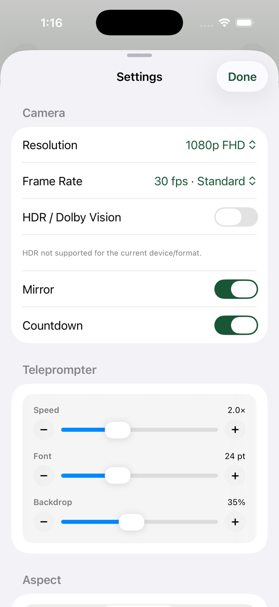
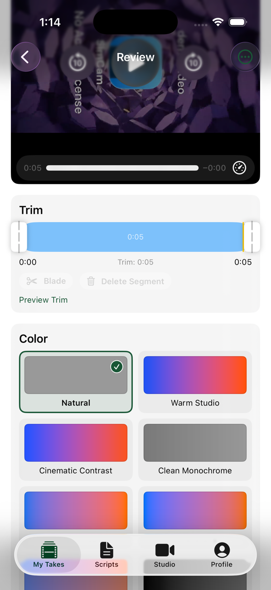
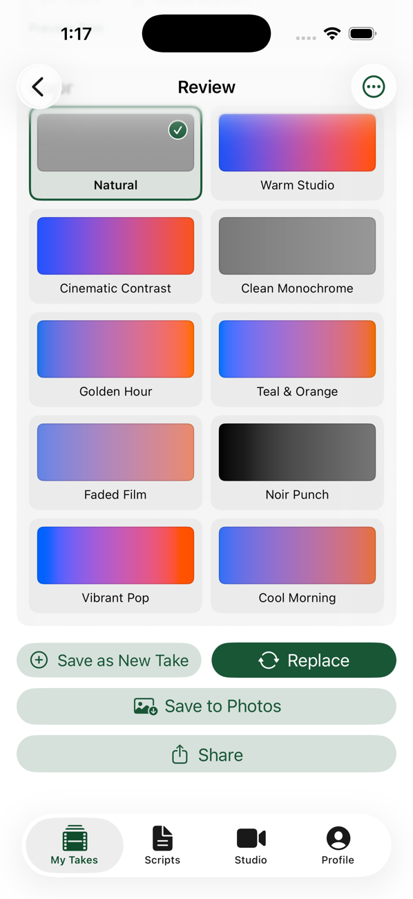
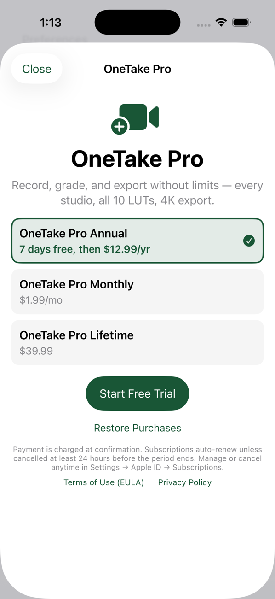
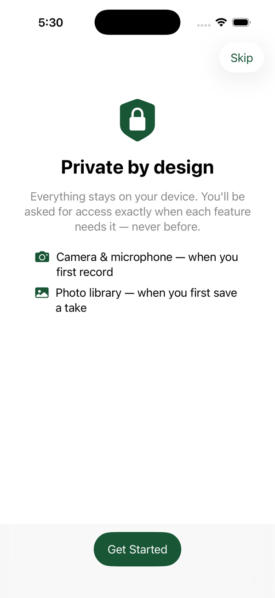

<p align="center"></p>

# OneTake

**One-take teleprompter + camera for iOS — scripts, prompter, takes, trim & LUT, all offline.**

OneTake lets creators write scripts, read them from a scrolling prompter while the front camera records, then trim, blade-split, grade with 3D LUTs, and save to Photos — with zero network dependency. Built 100% in SwiftUI + SwiftData for iOS 18.6+ (Liquid Glass on iOS 26).

   

## Download

<a href="https://apps.apple.com/us/app/onetake-teleprompter-studio/id6809885525"></a>

**[OneTake: Teleprompter Studio on the App Store](https://apps.apple.com/us/app/onetake-teleprompter-studio/id6809885525)**. Scan with your iPhone camera:

<a href="https://apps.apple.com/us/app/onetake-teleprompter-studio/id6809885525"></a>

## Screenshots

| ① Write | ② Record | ③ Tune the prompter |
|:---:|:---:|:---:|
|  |  |  |
| Scripts grouped by category, with search and filters | Pick **Teleprompter** or **Reaction** (auto cut-out) | Camera, speed, font size and backdrop |

| ④ Trim & split | ⑤ Color grade | ⑥ OneTake Pro | ⑦ Private by design |
|:---:|:---:|:---:|:---:|
|  |  |  |  |
| Dual-handle trim and blade timeline | 10 built-in LUTs with live swatches | 7-day trial · Annual · Monthly · Lifetime (RevenueCat) | No account, no cloud, permissions asked in context |

## Features

- **Scripts** — SwiftData-backed library, search, duplicate, category grouping, sort (Updated/Created/Title), context-menu Move to Category
- **Studio** — Front camera + teleprompter (adjustable speed/font/opacity), countdown, aspect masks, pause/resume with Live Activity, thermal downgrade, per-tab state
- **My Takes** — Day-grouped takes with script title resolution, file-missing handling, blade split/delete (segment timeline), search
- **Review** — `VideoPlayer` preview, dual-handle trim + blade timeline, LUT picker with rendered 40×24 swatches, export (`passthrough` or `CIFilter.colorCube` composition), Save to Photos + `ShareLink`, grouped edit menus
- **Profile** — Settings entry, about/version

## Tech Stack

| Layer | Choice |
|-------|--------|
| UI | SwiftUI, Observation (`@Observable`, `@Bindable`), `NavigationStack` + `TabView(sidebarAdaptable)` |
| Persistence | SwiftData (`@Model`, `@Query`, lightweight migration) |
| Media | `AVFoundation` (`AVCaptureSession`, `AVMutableComposition`, `AVVideoComposition`), `CoreImage` + `Metal`, `AVKit`, `Photos` |
| System | `AppIntents`, `ActivityKit` Live Activities, `Haptics` |
| Tooling | Xcode 17 (26.5 SDK), SwiftLint 0.65.1, SwiftFormat 0.63.0, OpenSpec (spec-driven) |
| Style | HIG, Liquid Glass, semantic colors (`AccentColor` #195636, `BrandSecondary` #FCCD03) |

## Quick Start

```bash
git clone <repo> && cd OneTake
open OneTake.xcodeproj
# Select iPhone 17 Pro simulator, Cmd+R
# Tests: Product → Test (Cmd+U) or:
xcodebuild test -project OneTake.xcodeproj -scheme OneTake -destination 'platform=iOS Simulator,name=iPhone 17 Pro'
```

See `docs/GETTING_STARTED.md` for detailed setup, `docs/ARCHITECTURE.md` for the full map, `docs/CODEMAP.md` for file-by-file responsibilities, and [`AGENTS.md`](AGENTS.md) (agent/human entry point — links every doc, sets the maintainability contract).

## Project Status

- **Navigation:** Unified 4-tab bar (My Takes / Scripts / Studio / Profile) — Studio is a first-class tab, not a sheet
- **Color:** LUT picker shows rendered swatches (CoreImage `colorCube` thumbnails, cached); app accent is `AccentColor` via `AppTheme`
- **Editing:** Blade timeline (split at playhead, delete segment + undo, trim-pruned cuts, composition export) with grouped menus in My Takes & Review
- **Lint:** `swiftlint lint OneTake --quiet` → **0 violations**, `swiftformat --lint .` → **0/40 files require formatting**. See `docs/LINT_REPORT.md`.

## Documentation

- **[AGENTS.md](AGENTS.md)** — **Start here** for agents & humans: doc map, architecture quick-ref, code map, how to work (lint/test/spec), maintainability contract (comments, links)
- [Architecture](docs/ARCHITECTURE.md) — layers, data flow, navigation (4-tab), persistence, features, `Core/*` services, theme, testing, OpenSpec
- [Getting Started](docs/GETTING_STARTED.md) — build, run, test, lint/format, simulator tips
- [Code Map](docs/CODEMAP.md) — every folder/file and what it owns
- [Persistence](docs/PERSISTENCE.md) — data contract: models, store layout, migration rules
- [SwiftUI Guidelines](docs/SWIFTUI_GUIDELINES.md) — **read before implementing any view**: HIG design principles, iOS patterns, pre-implementation gate, code rules, Definition of Done
- [Lint Report](docs/LINT_REPORT.md) — best-practice audit (0 violations), before/after, remaining plan
- [Pricing](docs/PRICING.md) — monetization plan (7-day trial + $12.99/yr / $1.99/mo / $39.99 lifetime); paywall implemented via RevenueCat
- [Store Setup](docs/STORE_SETUP.md) — owner checklist: App Store Connect + RevenueCat dashboard + legal content + sandbox QA
- [OpenSpec](openspec/) — spec-driven changes (`unified-tabs-lut-preview-blade-trim`, `bottom-nav-studio-flow`)

## License

Code is MIT licensed, see [`LICENSE`](LICENSE). The **OneTake** name, logo and app icon (`OneTake/Resources/logo.icon`) are not covered by the license and may not be used to publish a copy of the app.
